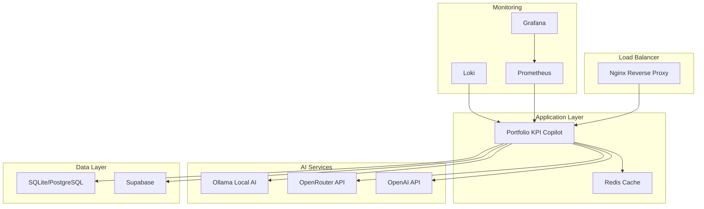

# 🚀 Production Deployment Guide - Portfolio KPI Copilot

## Overview

This guide provides comprehensive instructions for deploying Portfolio KPI Copilot to production with enterprise-grade reliability, security, and performance.

## 🏗️ Production Architecture

### System Components



## 🔧 Prerequisites

### System Requirements

- **OS**: Ubuntu 20.04+ / CentOS 8+ / RHEL 8+
- **CPU**: 4+ cores (8+ recommended)
- **RAM**: 8GB minimum (16GB+ recommended)
- **Storage**: 100GB+ SSD
- **Network**: Static IP, domain name, SSL certificate

### Software Dependencies

```bash
# Docker & Docker Compose
curl -fsSL https://get.docker.com -o get-docker.sh
sudo sh get-docker.sh
sudo curl -L "https://github.com/docker/compose/releases/download/v2.20.0/docker-compose-$(uname -s)-$(uname -m)" -o /usr/local/bin/docker-compose
sudo chmod +x /usr/local/bin/docker-compose

# Node.js (for local development)
curl -fsSL https://deb.nodesource.com/setup_18.x | sudo -E bash -
sudo apt-get install -y nodejs

# Additional tools
sudo apt-get update
sudo apt-get install -y curl wget git nginx certbot
```

## 🚀 Deployment Steps

### 1. Server Preparation

```bash
# Create application user
sudo useradd -m -s /bin/bash portfolio
sudo usermod -aG docker portfolio

# Create directories
sudo mkdir -p /opt/portfolio-kpi-copilot
sudo mkdir -p /opt/backups
sudo mkdir -p /var/log/portfolio
sudo chown -R portfolio:portfolio /opt/portfolio-kpi-copilot
sudo chown -R portfolio:portfolio /opt/backups
sudo chown -R portfolio:portfolio /var/log/portfolio

# Switch to application user
sudo su - portfolio
```

### 2. Code Deployment

```bash
# Clone repository
cd /opt/portfolio-kpi-copilot
git clone https://github.com/your-org/portfolio-kpi-copilot.git .

# Copy production environment
cp .env.production.example .env.production

# Edit environment variables
nano .env.production
```

### 3. SSL Certificate Setup

```bash
# Option 1: Let's Encrypt (Recommended)
sudo certbot certonly --standalone -d your-domain.com -d www.your-domain.com

# Copy certificates to Docker volume
sudo cp /etc/letsencrypt/live/your-domain.com/fullchain.pem docker/nginx/ssl/cert.pem
sudo cp /etc/letsencrypt/live/your-domain.com/privkey.pem docker/nginx/ssl/key.pem

# Option 2: Self-signed (Development only)
openssl req -x509 -nodes -days 365 -newkey rsa:2048 \
    -keyout docker/nginx/ssl/key.pem \
    -out docker/nginx/ssl/cert.pem \
    -subj "/C=US/ST=State/L=City/O=Organization/CN=your-domain.com"
```

### 4. Production Deployment

```bash
# Make deployment script executable
chmod +x scripts/deploy-production.sh

# Run deployment
./scripts/deploy-production.sh
```

## 🔒 Security Configuration

### Environment Variables

**Critical Security Settings:**

```env
# Strong secrets (minimum 32 characters)
NEXTAUTH_SECRET="your-super-secure-nextauth-secret-min-32-chars"
ENCRYPTION_KEY="your-32-character-encryption-key"
REDIS_PASSWORD="your-secure-redis-password"

# Production URLs
NEXTAUTH_URL="https://your-domain.com"
CORS_ORIGIN="https://your-domain.com"

# Security features
ENABLE_RATE_LIMITING="true"
ENABLE_SECURITY_HEADERS="true"
ENABLE_CSP="true"
```

### Firewall Configuration

```bash
# UFW Firewall setup
sudo ufw default deny incoming
sudo ufw default allow outgoing
sudo ufw allow ssh
sudo ufw allow 80/tcp
sudo ufw allow 443/tcp
sudo ufw enable

# Optional: Monitoring ports (restrict to specific IPs)
sudo ufw allow from YOUR_MONITORING_IP to any port 3001  # Grafana
sudo ufw allow from YOUR_MONITORING_IP to any port 9090  # Prometheus
```

### SSL/TLS Configuration

The Nginx configuration includes:
- TLS 1.2 and 1.3 support
- Strong cipher suites
- HSTS headers
- Perfect Forward Secrecy

## 📊 Monitoring Setup

### Grafana Dashboards

Access Grafana at `http://your-domain:3001`

**Default Login:**
- Username: `admin`
- Password: Set in `GRAFANA_PASSWORD` environment variable

**Pre-configured Dashboards:**
- Application Performance
- System Resources
- AI Service Metrics
- User Activity
- Error Tracking

### Prometheus Metrics

Access Prometheus at `http://your-domain:9090`

**Key Metrics:**
- Request rate and latency
- Error rates
- Database performance
- AI service availability
- System resources

### Log Aggregation

Logs are collected by Promtail and stored in Loki:
- Application logs
- Nginx access/error logs
- System logs
- Container logs

## 🔄 Backup & Recovery

### Automated Backups

Backups run daily at 2 AM (configurable):

```bash
# Manual backup
docker exec portfolio-kpi-copilot-prod npm run backup

# Restore from backup
docker exec portfolio-kpi-copilot-prod npm run restore -- /path/to/backup.tar.gz
```

### Backup Components

- **Application Data**: User data, KPIs, portfolios
- **Database**: SQLite/PostgreSQL dumps
- **Configuration**: Environment files, certificates
- **AI Models**: Ollama model data

## 🚨 Health Monitoring

### Health Check Endpoints

```bash
# Application health
curl https://your-domain.com/api/health

# Detailed health check
curl https://your-domain.com/api/health?detailed=true

# Component-specific health
curl https://your-domain.com/api/health?component=database
```

### Alerting

Configure alerts for:
- Application downtime
- High error rates
- Resource exhaustion
- Security incidents
- Backup failures

## 🔧 Maintenance

### Regular Tasks

**Daily:**
- Monitor health dashboards
- Review error logs
- Check backup status

**Weekly:**
- Update security patches
- Review performance metrics
- Clean up old logs

**Monthly:**
- Update dependencies
- Review access logs
- Performance optimization

### Updates & Patches

```bash
# Update application
cd /opt/portfolio-kpi-copilot
git pull origin main
./scripts/deploy-production.sh

# Update system packages
sudo apt update && sudo apt upgrade -y

# Update Docker images
docker-compose -f docker/docker-compose.production.yml pull
docker-compose -f docker/docker-compose.production.yml up -d
```

## 🚀 Scaling Considerations

### Horizontal Scaling

For high-traffic deployments:

1. **Load Balancer**: Use external load balancer (AWS ALB, Cloudflare)
2. **Multiple App Instances**: Scale application containers
3. **Database**: Migrate to PostgreSQL with read replicas
4. **Cache**: Use Redis Cluster
5. **AI Services**: Distribute AI workload

### Performance Optimization

```bash
# Enable Redis caching
ENABLE_REDIS_CACHE="true"

# Optimize database
DB_POOL_SIZE="20"
DB_TIMEOUT="30000"

# CDN for static assets
# Configure CloudFlare or AWS CloudFront
```

## 🔍 Troubleshooting

### Common Issues

**Application Won't Start:**
```bash
# Check logs
docker-compose -f docker/docker-compose.production.yml logs portfolio-kpi-copilot

# Check environment
docker exec portfolio-kpi-copilot-prod env | grep -E "(NODE_ENV|DATABASE_URL)"
```

**Database Connection Issues:**
```bash
# Test database
docker exec portfolio-kpi-copilot-prod npm run db:test

# Reset database
docker exec portfolio-kpi-copilot-prod npm run db:reset
```

**AI Services Not Working:**
```bash
# Check Ollama
curl http://localhost:11434/api/tags

# Check OpenRouter
docker exec portfolio-kpi-copilot-prod npm run test:ai
```

### Log Locations

- **Application**: `/var/log/portfolio/app.log`
- **Nginx**: `/var/log/nginx/`
- **Docker**: `docker logs <container_name>`
- **System**: `/var/log/syslog`

## 📞 Support

### Emergency Contacts

- **System Administrator**: admin@your-domain.com
- **Development Team**: dev@your-domain.com
- **Security Team**: security@your-domain.com

### Documentation

- **API Documentation**: `https://your-domain.com/api/docs`
- **User Guide**: `https://your-domain.com/docs`
- **Admin Guide**: `https://your-domain.com/admin/docs`

---

## ✅ Production Checklist

Before going live, ensure:

- [ ] SSL certificates installed and valid
- [ ] Environment variables configured
- [ ] Database migrations completed
- [ ] Monitoring dashboards accessible
- [ ] Backup system tested
- [ ] Health checks passing
- [ ] Security headers configured
- [ ] Rate limiting enabled
- [ ] Error tracking active
- [ ] Performance monitoring setup
- [ ] Documentation updated
- [ ] Team trained on operations

**🎉 Your Portfolio KPI Copilot is now production-ready!**
