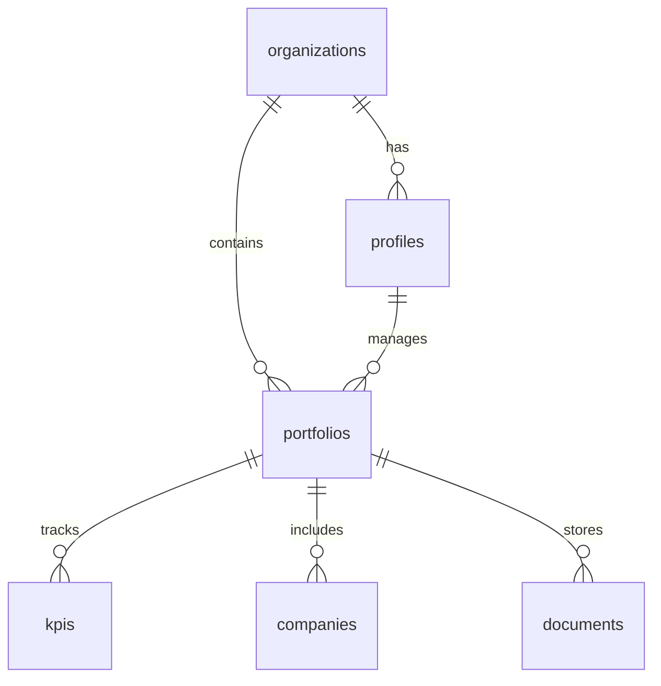

# 🚀 Supabase Integration Guide - Portfolio KPI Copilot

## Overview

This document describes the complete Supabase integration for Portfolio KPI Copilot, providing real-time data synchronization, vector search capabilities, and enterprise-grade scalability.

## 🏗️ Architecture

### Core Components

1. **Supabase Server Client** (`src/lib/supabase/server.ts`)
   - Production-ready server-side operations
   - RBAC integration
   - Real-time subscriptions
   - Vector search capabilities

2. **Supabase Client Manager** (`src/lib/supabase/client.ts`)
   - Client-side real-time subscriptions
   - File upload management
   - Presence tracking
   - Connection management

3. **Hybrid Data Layer** (`src/lib/data/hybrid-data-layer.ts`)
   - Intelligent fallback between Supabase and SQLite
   - Performance optimization
   - Unified API interface

## 🔧 Setup Instructions

### 1. Create Supabase Project

1. **Go to Supabase Dashboard:**
   - Visit: https://supabase.com/dashboard
   - Create new project
   - Note your project URL and API keys

2. **Configure Environment Variables:**
   ```env
   NEXT_PUBLIC_SUPABASE_URL="https://your-project.supabase.co"
   NEXT_PUBLIC_SUPABASE_ANON_KEY="your-supabase-anon-key"
   SUPABASE_SERVICE_ROLE_KEY="your-supabase-service-role-key"
   
   # Feature flags
   USE_SUPABASE_PRIMARY="true"
   FALLBACK_TO_SQLITE="true"
   ENABLE_REALTIME_SUBSCRIPTIONS="true"
   ENABLE_VECTOR_SEARCH="true"
   ```

### 2. Initialize Database Schema

```bash
# Run Supabase setup script
npx ts-node scripts/setup-supabase.ts
```

This script will:
- ✅ Create all required tables
- ✅ Set up Row Level Security (RLS) policies
- ✅ Create performance indexes
- ✅ Enable real-time subscriptions
- ✅ Create test data
- ✅ Verify setup

### 3. Enable Required Extensions

In your Supabase SQL editor, run:

```sql
-- Enable pgvector for vector search
CREATE EXTENSION IF NOT EXISTS vector;

-- Enable UUID generation
CREATE EXTENSION IF NOT EXISTS "uuid-ossp";

-- Enable real-time
ALTER PUBLICATION supabase_realtime ADD TABLE portfolios;
ALTER PUBLICATION supabase_realtime ADD TABLE kpis;
ALTER PUBLICATION supabase_realtime ADD TABLE organizations;
ALTER PUBLICATION supabase_realtime ADD TABLE documents;
```

## 📊 Database Schema

### Core Tables

| Table | Description | Key Features |
|-------|-------------|--------------|
| `organizations` | Multi-tenant organizations | RLS enabled, JSONB settings |
| `profiles` | User profiles (extends auth.users) | Role-based access |
| `portfolios` | Investment portfolios | Organization-scoped |
| `kpis` | Key Performance Indicators | Time-series data, categories |
| `companies` | Portfolio companies | Detailed company information |
| `documents` | Document storage for RAG | Vector embeddings, full-text search |

### Relationships



## 🔒 Security Implementation

### Row Level Security (RLS)

All tables have RLS enabled with policies that ensure:
- Users can only access data from their organizations
- Proper role-based permissions are enforced
- Data isolation between tenants

### Example RLS Policy

```sql
-- Users can only view portfolios in their organization
CREATE POLICY "Users can view portfolios in their organization" 
ON portfolios FOR SELECT USING (
  organization_id IN (
    SELECT organization_id FROM profiles 
    WHERE id = auth.uid()
  )
);
```

## 📡 Real-time Features

### Available Subscriptions

1. **Portfolio Updates**
   ```typescript
   supabaseClient.subscribeToPortfolios(organizationId, (payload) => {
     console.log('Portfolio updated:', payload)
   })
   ```

2. **KPI Updates**
   ```typescript
   supabaseClient.subscribeToKPIs(portfolioId, (payload) => {
     console.log('KPI updated:', payload)
   })
   ```

3. **Organization Updates**
   ```typescript
   supabaseClient.subscribeToOrganizations(userId, (payload) => {
     console.log('Organization updated:', payload)
   })
   ```

### Presence Tracking

```typescript
// Track user presence in collaborative features
supabaseClient.trackUserPresence('portfolio-123', userId, {
  name: 'John Doe',
  email: 'john@example.com',
  role: 'MANAGER'
})
```

## 🔍 Vector Search & RAG

### Document Upload with Embeddings

```typescript
// Upload document with automatic embedding generation
const { data } = await supabaseClient.uploadFile(
  'documents',
  `portfolio-${portfolioId}/report.pdf`,
  file,
  {
    metadata: {
      portfolioId,
      documentType: 'report'
    }
  }
)
```

### Semantic Search

```typescript
// Search documents and KPIs using natural language
const results = await fetch('/api/supabase/vector-search', {
  method: 'POST',
  headers: { 'Content-Type': 'application/json' },
  body: JSON.stringify({
    query: 'revenue growth trends',
    organizationId: 'org-123',
    searchType: 'all',
    limit: 10
  })
})
```

## 🔌 API Endpoints

### Supabase-Specific APIs

| Endpoint | Description | RBAC |
|----------|-------------|------|
| `/api/supabase/portfolios/rbac` | RBAC-protected portfolio operations | ✅ |
| `/api/supabase/kpis` | Real-time KPI management | ✅ |
| `/api/supabase/realtime` | Subscription management | ✅ |
| `/api/supabase/vector-search` | Semantic search | ✅ |
| `/api/supabase/status` | Health monitoring | ✅ |

### Usage Examples

```typescript
// Get portfolios with real-time updates
const response = await fetch('/api/supabase/portfolios/rbac?organizationId=org-123&includeKPIs=true')

// Create KPI with automatic real-time sync
const kpiResponse = await fetch('/api/supabase/kpis', {
  method: 'POST',
  body: JSON.stringify({
    portfolioId: 'portfolio-123',
    name: 'Monthly Revenue',
    category: 'financial',
    value: 150000,
    unit: 'USD',
    periodDate: '2024-12-01'
  })
})
```

## 🔄 Hybrid Data Layer

### Intelligent Fallback

The system automatically chooses the best data source:

1. **Primary**: Supabase (if configured and healthy)
2. **Fallback**: SQLite (for development and backup)

### Configuration

```typescript
// Environment variables control behavior
USE_SUPABASE_PRIMARY=true    // Prefer Supabase when available
FALLBACK_TO_SQLITE=true      // Use SQLite as backup
```

### Status Monitoring

```typescript
// Check hybrid data layer status
const status = await hybridData.getStatus()
console.log('Active source:', status.activeSource) // 'supabase' or 'sqlite'
```

## 📈 Performance Optimization

### Database Indexes

Automatically created for optimal performance:

```sql
-- Key indexes for fast queries
CREATE INDEX idx_portfolios_organization_id ON portfolios(organization_id);
CREATE INDEX idx_kpis_portfolio_id ON kpis(portfolio_id);
CREATE INDEX idx_kpis_period_date ON kpis(period_date);
CREATE INDEX idx_documents_portfolio_id ON documents(portfolio_id);
```

### Caching Strategy

- **Client-side**: Real-time subscription caching
- **Server-side**: Query result caching
- **Hybrid**: Intelligent data source selection

## 🧪 Testing

### Health Checks

```bash
# Test Supabase connection
curl "http://localhost:3000/api/supabase/status"

# Run comprehensive diagnostics
curl -X POST "http://localhost:3000/api/supabase/status" \
  -H "Content-Type: application/json" \
  -d '{"tests": ["all"]}'
```

### Real-time Testing

```typescript
// Test real-time subscriptions
const subscription = supabaseClient.subscribeToPortfolios(
  'org-123',
  (payload) => console.log('Real-time update:', payload)
)

// Clean up
subscription.unsubscribe()
```

## 🚨 Troubleshooting

### Common Issues

1. **Connection Errors**
   - Verify Supabase URL and API keys
   - Check network connectivity
   - Ensure RLS policies are correct

2. **Real-time Not Working**
   - Verify real-time is enabled in Supabase dashboard
   - Check subscription filters
   - Ensure proper authentication

3. **Vector Search Issues**
   - Verify pgvector extension is enabled
   - Check embedding generation
   - Ensure documents have embeddings

### Debug Commands

```bash
# Check Supabase status
npm run supabase:status

# Test hybrid data layer
npm run test:hybrid

# Verify RBAC integration
npm run test:rbac
```

## 🔄 Migration from SQLite

### Automatic Migration

The hybrid data layer provides seamless migration:

1. **Development**: Start with SQLite
2. **Staging**: Add Supabase configuration
3. **Production**: Enable Supabase as primary

### Manual Migration

```bash
# Export data from SQLite
npm run export:sqlite

# Import to Supabase
npm run import:supabase

# Verify migration
npm run verify:migration
```

## 📊 Monitoring & Analytics

### Built-in Monitoring

- **Connection health**: Automatic monitoring
- **Performance metrics**: Response time tracking
- **Error tracking**: Comprehensive error logging
- **Usage analytics**: Query and subscription metrics

### Dashboards

Access monitoring at:
- **Status**: `/api/supabase/status`
- **Health**: `/api/system/comprehensive-status`
- **Analytics**: Supabase dashboard

## 🚀 Production Deployment

### Environment Setup

1. **Supabase Project**: Production instance
2. **Environment Variables**: All required vars set
3. **RLS Policies**: Properly configured
4. **Indexes**: Performance optimized
5. **Monitoring**: Health checks enabled

### Scaling Considerations

- **Connection pooling**: Automatic in Supabase
- **Read replicas**: Available in Supabase Pro
- **Caching**: Redis integration ready
- **CDN**: File storage with CDN

---

**✅ Supabase Integration Status: COMPLETE**

The Supabase integration is fully implemented with real-time capabilities, vector search, RBAC security, and production-ready scalability.
